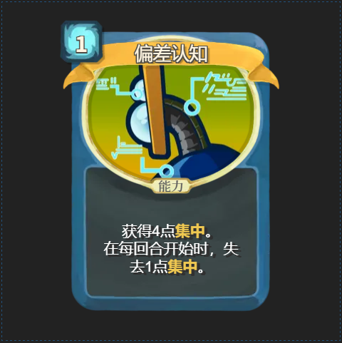

# 认知偏差

1. 摒弃高中思维，别把课堂看得太重。在计算机领域，全世界**绝大部分**高校的**绝大部分**课程都是**垃圾课程**。推荐阅读：
    - [上海交通大学生存指南](https://survivesjtu.gitbook.io/survivesjtumanual/li-zhi-pian/huan-ying-lai-dao-shang-hai-jiao-tong-da-xue)
    - [在南京大学的四年 - 软件工程与纸上谈兵](https://blog.lyc8503.net/post/4-years-at-nju/)
2. 计算机世界远比你想象中的要开阔；学习资源远比你想象中更容易获得。推荐阅读：
    - [CS 自学指南](https://csdiy.wiki/)
3. 读研不是必须的，你真的适合读研吗？推荐阅读 SOSP'23 Best Paper 获得者蒋炎岩的《科研劝退信》与《绿导师是怎样戴帽的：学术跃进运动的来龙去脉》：
    - [Yanyan's wiki](https://jyywiki.cn/)
4. 你想过一个怎样的人生？人生不是一条单行道，勇敢的人才能享受世界。推荐**每年重新**阅读：
    - [从广深到北美--毕业这四年 -- 清水河畔](https://bbs.uestc.edu.cn/thread/2206883)

