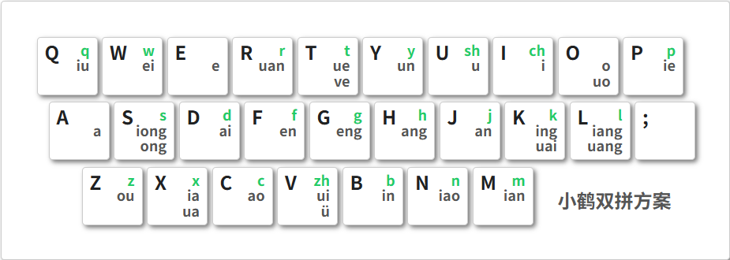

# 效率提升

## 打字打字……

### 指法与盲打

90% 以上的新生应该都是不会**盲打**的：

- 你可能上大学很少使用电脑，对键盘不熟悉，经常**二指禅**看着键盘一个一个敲
- 你可能以前是游戏玩家，左手是标准的 **WASD** 键位，对于 ++5+6+t+b++ 这几个中间的键感到棘手

因此，我们十分推荐你通过 [dazidazi-在线打字练习](https://dazidazi.com/) 这个网站学习**标准指法**并练习盲打（只看屏幕，凭肌肉记忆打字）。作为一项将会贯彻你职业生涯的最基本的技能，在前期投入时间精力练习是很有必要的。

### 输入法

工欲善其事，必先利其器。一款好的输入法也是提升效率的一大法宝，我们在此推荐腾讯的 [微信输入法](https://z.weixin.qq.com/)。

相较于以前大家常用的**搜狗输入法**，微信输入法：

- 纯净无广，极简主义
- 可以为常用语设置「输入码」，比如你可以在设置后输入「xh」打出自己的学号，输入「dz」打出地址……
- 跨设备云端互通，你的词库、剪贴板、常用语等可以在手机、平板、电脑上同步，可以做到「电脑上复制一段文本，马上在手机上粘贴」

我认为其唯一的缺点就是没有 Linux 版本。

### 双拼

我相信绝大多数同学使用的都是「汉语全拼」（可能也有小部分同学受长辈影响用的五笔？），全拼虽然符合直觉，常用词语也能做到只需声母就打出整个单词，但当你遇到「无双」、「变装」、「调整」等词时，你会发现只输声母可能要翻好久才能找到，要么就麻烦点输入完整的拼音。

但其实我们还有另一种输入模式——[双拼](https://zh.wikipedia.org/wiki/%E5%8F%8C%E6%8B%BC)。它通过扩展键盘映射，实现了「所有字都只需两个键就能确定」的效果。也就是说，你只需要输入一个「声母」和一个「韵母」你就能确定一个字的发音（除了声调）。

**小鹤双拼**是我认为最合理的双拼方案，它的键位映射如下：

所以想要打出「小鹤双拼」这四个字，你只需要输入「xn'he'ul'pb」，而全拼想要准确打出这四个字则需要输入「xiao'he'shuang'pin」。经过调研，我发现掌握双拼后（比如我）的打字效率大约能达到全拼的**两倍**，所以个人认为这项技能还是非常值得投资的！

> [dazidazi-在线打字练习](https://dazidazi.com/) 同样可以练习双拼

## 浏览器

1. 按住 ++ctrl++ 点击链接可以保持页面不变并在新标签页打开它
2. 按住 ++alt++ 可以轻松选中链接中的文字（常用于复制）而不会打开链接
3. 在浏览器**扩展商店**可以安装**广告屏蔽**（如 adguard）、**网页翻译**（如“沉浸式翻译”）等好用的扩展
