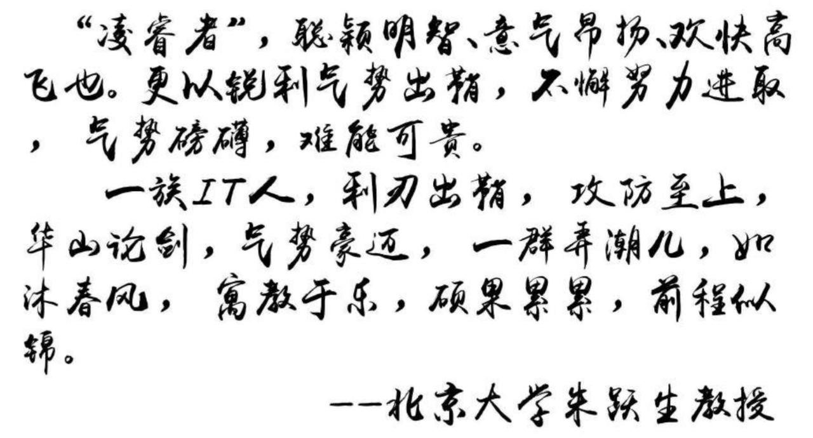
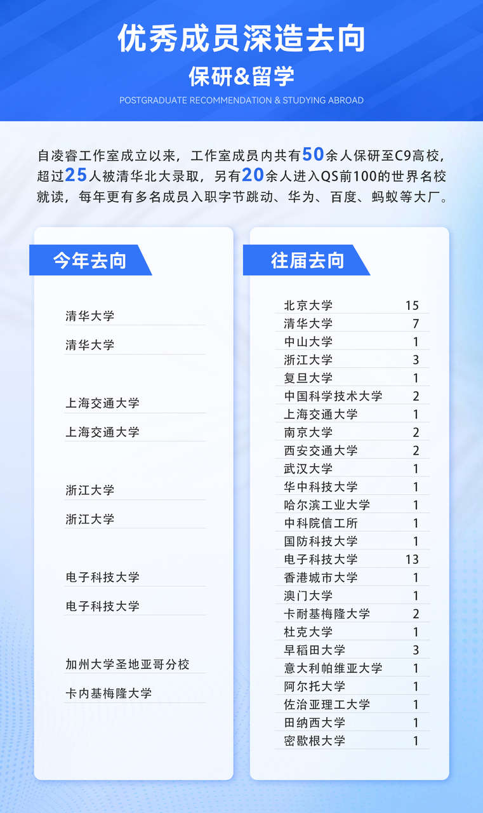
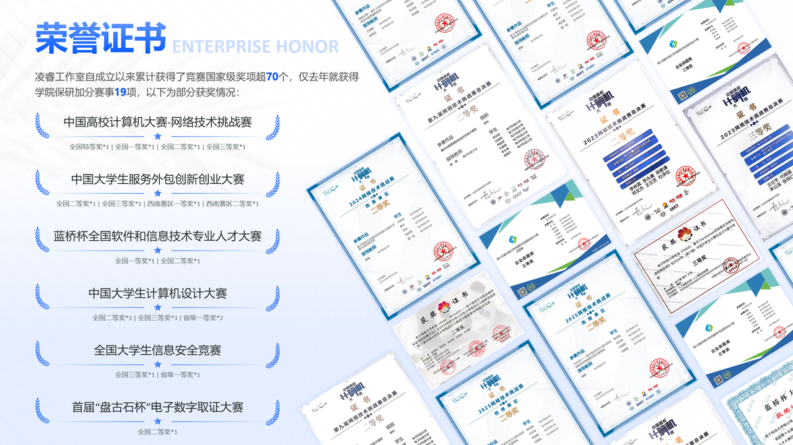
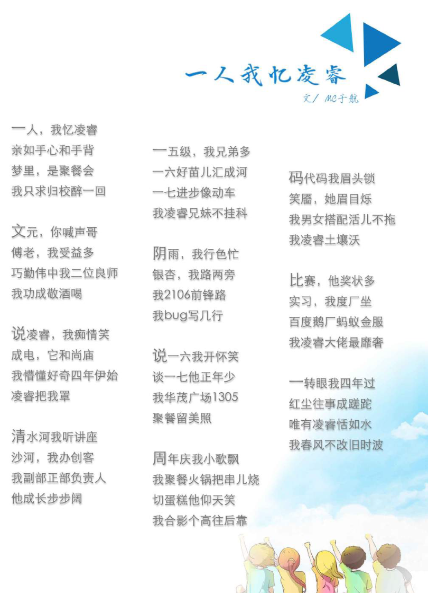

# 新人指南

这里是电子科技大学凌睿工作室为帮助新生了解工作室和快速融入大学生活而撰写的新人指南。

招新 QQ 群：……

招新平台：[***凌睿 2026 招新平台***](https://lingrui.studio){ .md-button }

## 什么是工作室

工作室不同于大家所熟知的兴趣社团，想加入工作室是要参与招新考核的，并且工作室内部的管理更加正式和规范。

具体而言，工作室是一个**技术向的学生组织**，由学校提供支持和背书。不同于课堂上老师讲授的东西，工作室的学长学姐往往会向你介绍业界最先进的技术与研究动态，在就业和深造方面为你提供帮助。当然，工作室老登往往还沉淀了许多课内“焚决”，帮助小登拿到高分或短时间速成。此外，在工作室内部组队打比赛拿奖也是常态，经历过招新筛选的队友总比随机选人更加靠谱。

你可能已经注意到，软院有非常多的工作室，可以说每个工作室都有非常厉害的学长学姐，但综合实力与底蕴是参差不齐的，每个工作室的氛围、气质以及主攻方向也是截然不同的。

下面，我将为你详细介绍一下凌睿工作室，若是看完觉得很对你的胃口，不妨加入上方的招新群，与我们深入交流~

## 简介

**凌睿工作室**始于 2013 年，由 2012 级学长杨文元、2011 级学长暴鹏飞及傅翀老师、钱伟中老师和李巧勤老师等一行人联合创建。工作室发展至今，已经成为信软学院**规模最大、成绩最优秀、实力最强劲**的工作室之一。

凌睿工作室以创新和产品化作为自身发展的鲜明标志，并且十分重视工作室凝聚力、内部文化建设。我们追求的是寓教于乐，在和谐温馨的氛围中求同存异，共同进步。

成立十二年以来，凌睿始终秉承『凌历出鞘，睿意进取』的宗旨不断发展，现如今凌睿工作室已有 **机器学习 (ML)、密码学 (Crypto)、产品 (PM)、前端 (Frontend)、后端 (Backend)** 五大方向供工作室成员选择并为其发展助力。十二年内，我们不断积累经验，努力学习，积极参与各类项目及比赛提升团队综合能力。工作室也同三位优秀的指导老师有着密切合作，工作室成员也经常参与到各种项目中，在实践中学习，在实践中成长，为工作室成员的读研、出国、就业等打下了坚实的基础。

在培养体系方面，工作室具备老师组长指导、定制培养方案、定期技术分享、项目驱动发展四大培养体系，为新生打造一个体系完备、支撑多元的学习交流平台。不管你是小白还是大佬，只要你有一颗坚持学习的心，都可以加入我们的大家庭！

众人拾柴火焰高，在大家的努力下，凌睿不断发展，各方面都能在创新工坊中拔得头筹，值此招新之际，我们诚邀新人加入我们，一起迈着矫健的步伐书写新的故事！

## 指导老师介绍

- 傅翀：[主页](https://sise.uestc.edu.cn/info/1036/5688.htm)
- 钱伟中：[主页](https://sise.uestc.edu.cn/info/1036/5725.htm)
- 李巧勤：[主页](https://sise.uestc.edu.cn/info/1036/5714.htm)

## 成员去向

**深造**

工作室累计向 C9 高校输送超过 50 名优秀成员，另有 20 余人前往世界排名前 50 的大学留学深造，工作室毕业生累计超 20 人被清华北大录取，位列创新工坊第一。

**就业**

就业方面，每年**绝大部分**选择就业的成员都能进入腾讯、阿里、字节等一流大厂或 Minimax 这类 AI 独角兽。在前辈的指导下，多数成员很早就能开始实习，在毕业前积累相当多的大厂实习经历。

## 荣誉墙

在竞赛获奖这方面，凌睿常年在创新工坊名列前茅

> 例如，2024 年**中国高校计算机大赛网络技术挑战赛**软件学院共获得 14 项国奖，其中 8 个都有凌睿成员参与

## 在凌睿，还有这样的学长学姐……

- 导生：每年都有成员当选导生参与学院带新工作
- ACM-ICPC 选手：几乎每年都有校队成员
- 马拉松爱好者：凌睿最高的山——全马破三
- 开源爱好者：软院最大的开源资料仓库
- 游戏爱好者：随时上线 Steam 都能看到好友在线
- 桌游爱好者：每次团建都有好多桌游捏
- 麻将爱好者：随时随地搓一局
- 干饭爱好者：随时随地约一顿

## 我们还有……

- 非常活跃的 QQ 群（乐子、八卦等一手消息）
- 大量项目遗产和 idea（打比赛不知道该做什么？拿去用就是了！）
- 资源丰富的内部资料库（老一辈不外传的秘密资料）

> 听说凌睿还是第一脱单工作室

## 更多

可以在 [学院官网](https://sise.uestc.edu.cn/index.htm) 搜索"凌睿"了解更多信息

