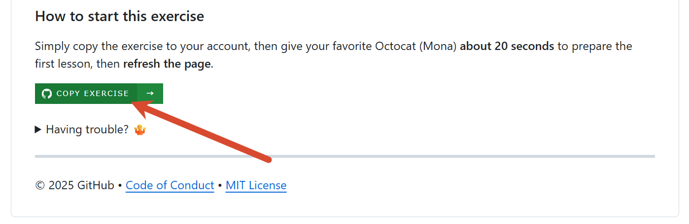
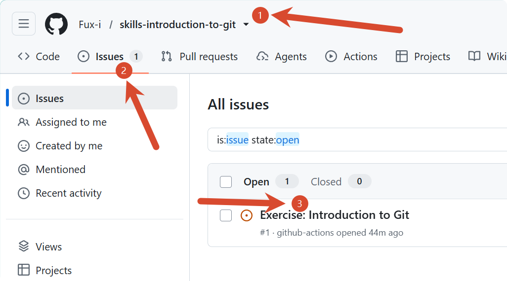

# Git 与 Github

## Git 简介

作为一个程序员，我们一定会有与他人协作完成代码，以及版本管理的需求。在没有 Git 的世界，我们往往只能通过 QQ、办公软件、U 盘等在多个地方同步，然后把不同时期的代码往硬盘上某个地方一丢，并标记一下版本号、更新内容、待解决的 bug……

这未免也太麻烦了吧！而且非常容易出错。

为了解决上述问题，Git 应运而生。根据 [Git 官方介绍](https://git-scm.com/)，Git 是一个**免费、开源的分布式版本控制系统**，能够快速、高效地管理从小型项目到大型项目的代码。简单来说，它会记录文件每次发生了什么变化、是谁改的，让你可以查看历史、找回旧版本，也方便多人合并各自的修改。

可以把 Git 理解成管理代码版本的工具，把 GitHub 理解成存放和协作开发这些代码的线上平台。

## Git 安装

根据 [Git - Install](https://git-scm.com/install/) 与自己的操作系统进行安装。

## Github 简介

大名鼎鼎的 Github 是全球最大的 ~~同性交友网站~~ 开源（开放项目源代码）网站，上面有无数世人所熟知的各种开源项目，每天都有非常多的开源爱好者一起维护/更新代码……

Git 与 GitHub 是单向绑定的：

- **Git** 即使不联网、不使用 GitHub，你也可以在本地创建仓库、提交修改和查看历史
- **GitHub** 是托管 Git 仓库并进行协作的网站。它在 **Git 的基础上**提供了远程备份、Issue、Pull Request、代码审查等功能。

我们介绍 Github 的目的如下：

- 你能在 Github 上见到最前沿的技术动态，如 [Trending repositories on GitHub today](https://github.com/trending) 和你关注的开源大佬最近在做什么项目
- 你能免费地通过 Github 与他人协作完成同一个项目
- 你能白嫖 Github 免费的 CI/CD 与服务器资源完成自定义构建、自定义工作流、自定义**个人博客**
- 在投简历时，如果你有一个非常漂亮的 Github 主页，那将会是一个非常大的加分项（展示你的技术栈、开源经历等）

官方介绍：https://docs.github.com/zh/get-started/start-your-journey/what-is-github

## 学习

原本是想自己写一大篇 Git 教程的，但是考虑到 Github 官方就有非常不错的教程，我们索性让大家跟着官方学习吧！

1. 首先，请用自己的常用邮箱注册一个 Github 账号（记得挑一个好的 username，因为它很可能会伴随你几十年）
2. 然后打开这个仓库页面：[Introduction to Git](https://github.com/skills/introduction-to-git/)，往下翻点击绿色的 :fontawesome-brands-github: **COPY EXERCISE** 按钮创建一个自己的仓库
    
3. 过几分钟，机器人就会给你发 Issue 了，里面就是具体的教程内容，跟着它的引导一步一步完成即可~
    

除此之外，官方也有 [中文 Git Book](https://git-scm.com/book/zh/v2)，可以随时查阅；如果你喜欢美观一点的，也可以参考 [Git Commands Reference - Terminal Guide](https://www.terminal.guide/git/commands/) 

> [Learn Git Branching](https://learngitbranching.js.org/?locale=zh_CN) 也是一个非常好的图形化交互式教程，不过它主要关注 git branch，对新生来说可能就有点难了，推荐等以后有更多 git 经验之后再来学习。

再说回 Github 本身，它也有一个官方的学习仓库 [Introduction to Github](https://github.com/skills/introduction-to-github/)，它会教你如何在 Github 上与他人协作，包括 *issues*、*pull request* 等内容，使用方式与上面那个一样，也推荐学习！

> 更多关于 Github 的技巧，可以看官方的教程：https://learn.github.com/skills

## 拓展

你可能已经注意到，这个网站右上角就有个 :fontawesome-brands-github: Github 仓库图标，每个页面右上角也都有两个小按钮，你可以前往本项目的的 Github 仓库一探究竟，也能顺藤摸瓜找到凌睿工作室在 Github 的 Organization 主页。

于是，在学习完前面的内容之后，还有个适合练手的小练习——为**本项目做贡献**！虽然这不是什么功能性软件，也没有多少代码，但作为你的第一个开源贡献还是绰绰有余的。

本身具体而言，你可以：

- 为 Wiki 提 Issue：找出这个 Wiki 的 type（错别字）、逻辑漏洞、或是经过你验证发现确实有错的内容，并通过 [Issues 界面](https://github.com/Lingrui-Studio/noob_guide/issues) 提交反馈
- 为 Wiki 提 Pull Request：直接为 Wiki 新增/修改内容，你需要先 Fork 本仓库创建一个自己的仓库，然后在你自己的仓库中修改内容，最后在 Github 上发起 [Pull Request](https://github.com/Lingrui-Studio/noob_guide/pulls) 等待管理员审核。

!!! info "Bonus"
    对于参与贡献的同学，可以增加**印象分**（独立于招新平台分数）喔。
