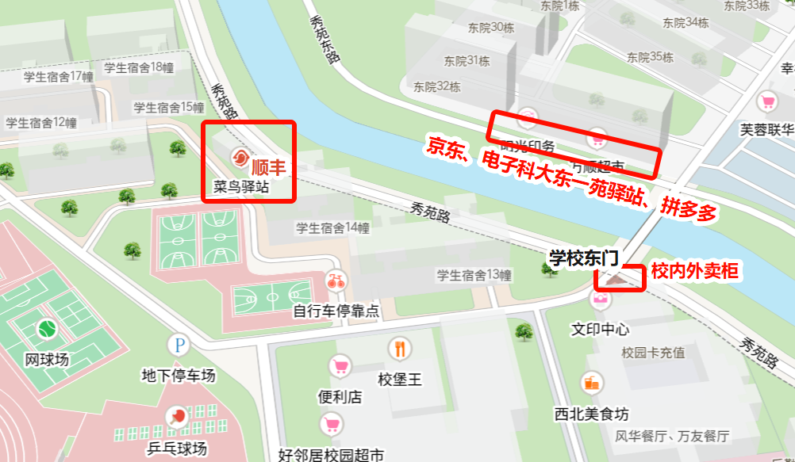
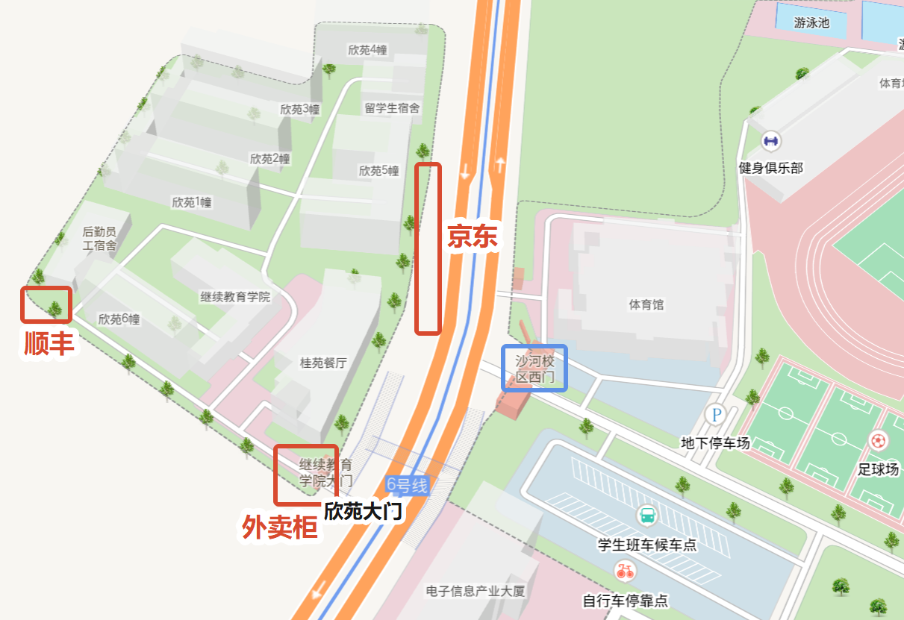
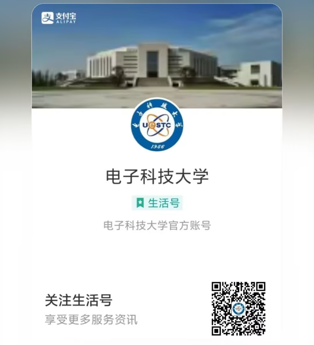

# 沙河生存指南

## 地理

你电有官方在线地图：[电子科技大学 - 可视化位置服务平台](https://gis.uestc.edu.cn/#/)

记得打开后右上角切换到沙河校区-微地图，并开启“大楼标签”，从此找路不求人！

### 快递与外卖

- 校内：都在东门附近，地址填“电子科技大学沙河校区东门”

- 校外：都在西门对面欣苑附近，地址填“电子科技大学欣苑学生公寓”

## 日常缴费

支付宝-生活号-电子科技大学

在此可以完成：

- 一卡通充值：用于食堂消费、浴室洗澡
- 电费充值：以宿舍为单位，缴费界面添加新房间号时有房间号说明，充值完毕有一两分钟延迟
- 沙河网络缴费：以宿舍为单位，登录一个同学的账号即可一起用，50 块半年还是比较划算，但网速一般（被 ban 了……以前有千兆）。
    - 默认账号：学号
    - 默认密码：`身份证后 7 位`+`@`

## 资源汇总

- [沙河开荒指南](https://river-side.cc/t/22388/1)：哪栋楼干啥的，本文讲得很清楚

|QQ 群|群号|描述|
|-|-|-|
|沙大吃吃吃|746444553|内含《沙河美食红黑榜》等|
|uestc 沙河旧货交易所|253021424|出/收二手|
|成电沙河校区失物招领群一群|490464046|失物招领|
